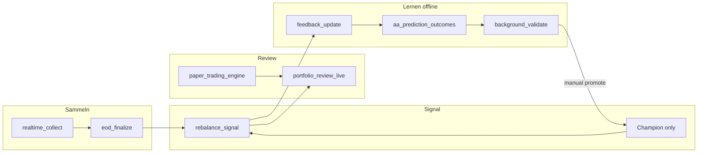

# Realtime / Behavioral Architecture — Active Alpha Model

Stand: 2026-05-30 · Status: **Planungsphase (Phase C–L noch nicht implementiert)**

## 1. Zielbild

Kontrolliert adaptives ML-System mit Champion/Challenger-Governance:

```text
Prognose am Rebalance-Termin
→ Marktverlauf beobachten (Intraday sammeln, EOD finalisieren)
→ nach Horizont Outcome berechnen
→ Fehler + Behavioral States auswerten
→ Challenger offline trainieren
→ vollständig validieren
→ nur nach manueller Freigabe promoten
```

**Nicht-Ziele:** Echtzeit-Alpha-Nachziehen, Online-Lernen auf unreifen Outcomes, automatische Champion-Promotion, automatische Echtgeldorders.

## 2. Rebalance als Entscheidungsuhr

| Phase | Verhalten |
|-------|-----------|
| Zwischen Rebalances | Quotes/Kurse aktualisieren, Portfolio bewerten, Intraday sammeln, **keine** neue Alpha-Zielallokation |
| Am Rebalance-Termin | Snapshot finalisieren, **Champion** anwenden, Zielportfolio + Handlungsvorschläge erzeugen |

## 3. Bestehende Infrastruktur (wiederverwenden)

| Komponente | Modul / Pfad | Rolle im Zielbild |
|------------|--------------|-------------------|
| Walk-forward Backtest | `aa_backtest.py`, `aa_backtest_ml.py` | Referenz für Outcome-Definition |
| Kalenderintegrität | `aa_integrity.py` | Gate vor jedem validierten Run |
| Run-Provenienz | `aa_run_provenance.py` → `runs/<run_id>/` | Isolierte Artefakte, `latest_validated_run.json` |
| Varianten-ID | `aa_variant_id.py` | Kanonische IDs (R0, R3_w070_q070_noexit, M1, …) |
| Fast-Path / GUI-Gate | `aa_ops_validation.py`, `aa_system_status.py` | `analytical_validity` vs. `operational_health` |
| Prediction Cache v3 | `aa_features.py` | Coverage + Fingerprint |
| Naive Baselines / M1 | `aa_backtest.py` (Phase C naive), `mom_blend_matched_controls` | Challenger-Vergleich |
| Paper Trading | `paper_trading_engine.py`, `run_paper_*.bat` | Basis für Live Portfolio Review |
| Datenqualität | `aa_data_quality_gate.py` | Gate vor Modellvergleichen |
| Validierungs-Orchestrator | `tools/run_validation_matrix.py` | Referenzläufe Phase B |
| Runtime-Profile | `aa_runtime_profile.py`, `aa_single_instance.py` | EXE vs. Hintergrund-Validierung |

## 4. Geplante neue Module (Phase C–L)

| Phase | Modul / Artefakt | Default |
|-------|------------------|---------|
| C | Async Jobs: `realtime_collect`, `eod_finalize`, `rebalance_signal`, `portfolio_review_live`, `feedback_update`, `background_validate` | deaktiviert |
| D | `MarketDataProvider`, `ReplayMarketDataProvider`, `market_data/raw|normalized|quality|features/` | Replay only |
| E | `aa_prediction_outcomes.py` → `prediction_ledger.parquet`, `prediction_outcomes.parquet` | deaktiviert |
| F | `aa_behavioral_features.py`, `aa_behavioral_reporting.py` | deaktiviert (nur Challenger) |
| G | `latest_validated_model.json`, `latest_validated_signal.json`, Promotion Gate | manuell |
| H | `portfolio_review_live` → `portfolio_review_live_*.csv/txt` | read-only |
| I | `background_validate` + Kostenstress-Matrix | kein Auto-Promote |
| J | Live-Provider-Adapter (env vars), Broker read-only | opt-in Scaffold |

## 5. Behavioral Market State (messbar, nicht psychologisch)

Version 1 — Featureblöcke (EOD-finalisiert, kein Lookahead):

- **attention_pressure:** relative_volume_same_time, volume_shock_zscore, …
- **continuation_pressure:** first_hour_return_vs_spy, close_vs_vwap, …
- **liquidity_stress:** median_spread_bps, spread_zscore, …
- **crowding_intensity:** sector_synchronous_move, cross_sectional_correlation_jump, …
- **reversal_risk:** high_to_close_reversal, failed_breakout_score, …
- **execution_friction:** aus Quotes/Spreads im Portfolio-Review-Pfad

Marktweite Aggregate über SPY + Top-100-Universum.

## 6. Champion / Challenger

| Rolle | ID-Beispiele | Promotion |
|-------|--------------|-----------|
| Champion | Manuell freigegebenes R3 (z. B. `R3_w070_q070_noexit`) | manuell |
| B0 | `B0_DAILY_REFERENCE` — validierter Champion ohne Behavioral | — |
| B1 | `B1_REALTIME_EXECUTION_ONLY` — Alpha wie B0, Intraday nur Execution-Diag | — |
| B2–B4 | Progressive Behavioral-Challenger | nur nach Integrity PASS + manueller Freigabe |

Vergleichsbenchmarks: R0, R3, M1, MOM_63_TOP12, SPY, QQQ, MTUM, SMH.

## 7. Datenfluss (Ziel)



## 8. Abhängigkeiten / Stop-Gates

1. **Phase A (Integrität)** muss PASS sein, bevor Phase C+ startet.
2. **Phase B (Referenzläufe)** erfordert Nutzerbestätigung für vollständige historische Läufe.
3. Behavioral Features erfordern historische Intraday-Basis (Replay oder gesammelte Daten).
4. Kein Challenger darf den Champion ohne dokumentierten Promotion-Gate ersetzen.

## 9. Windows-Betrieb (geplant)

Batch-Wrapper (noch nicht vorhanden):

- `run_realtime_collector.bat`
- `run_eod_finalize.bat`
- `run_rebalance_signal.bat`
- `run_portfolio_review_live.bat`
- `run_feedback_update.bat`
- `run_background_validation.bat`

Prozesslock, UTC-Logs, Exitcodes — siehe künftiges `BACKGROUND_JOB_OPERATIONS.md`.
