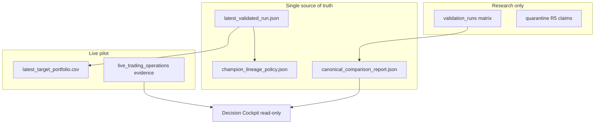
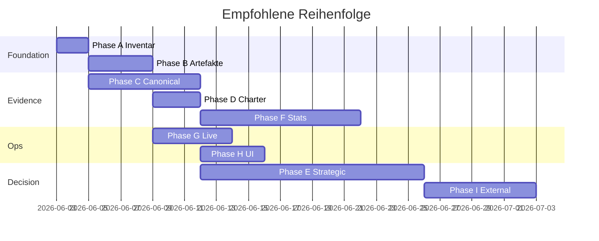

# Champion, Evidenz & Governance — Verbesserungsplan

**Stand:** 2026-06-02  
**Ziel:** Die im Review identifizierten Lücken schließen — ohne stillen Champion-Wechsel und ohne Änderung produktiver Signal-/Gewichte ohne explizite Freigabe.  
**Autoritativer Champion (unverändert bis Freigabe):** `R3_w075_q065_noexit`

---

## 0. Ausgangslage (Problemstatement)

| Thema | Ist-Zustand | Soll |
|-------|-------------|------|
| **Performance-Narrativ** | Champion ist **nicht** #1 Sharpe (Matrix: R0, M1, R2 vor R3; P11: MOM_63 oft stärker) | Transparent dokumentiert: *freigegeben ≠ optimal* |
| **Artefakte** | `challenger_report` zeigt teils **R5** als Champion; `latest_validated_run.json` mit R3-`variant_id` aber R5-`run_id`; P11-R3-Metriken ≠ Matrix-R3 (1860 vs 2450 Tage) | **Eine** Wahrheitsquelle pro Rolle (Champion / Challenger / Control) |
| **Vergleich** | Kalender und Runs vermischt | **Ein** Canonical Comparison Frame (G1-Logik) |
| **Promotion** | Auto-Promotion aus; Gates teils FAIL | Gates **evaluierbar** und im Cockpit **lesbar** |
| **Live** | Rebalance-Pipeline verbessert (Phasen 0–5), aber operative Reibung (Cash-Welle, Symbole) | Stabiler Champion→T212-Pfad mit messbarer Quote-Coverage |
| **Governance** | Externe Reviews verlangen R3; interne Reports widersprechen teils | Alignierte Reports + Quarantäne für R5-Claims |

**Nicht im Scope ohne separate Freigabe:** Champion-Wechsel, neue ökonomische Parameter, Auto-Promotion, Echtgeld-Massenorders, unautorisierte Backtest-Matrix-Expansion.

---

## 1. Leitprinzipien

1. **Fail-closed:** Fehlende oder widersprüchliche Evidenz blockiert keine Live-Orders zusätzlich (bereits Policy), aber blockiert **Champion-Wechsel** und **externe „bestes Modell“-Behauptungen**.
2. **Trennung Rollen:** CHAMPION (R3) · CONTROL (M1) · CHALLENGER (MOM_63*, R5 nur als Research) · SIBLINGS (R0–R4 Matrix).
3. **Ein Kalender pro Vergleich:** Alle Rankings in einem Report nutzen dieselbe `strategy_daily_returns`-Schnittmenge (≥200 überlappende Tage, Ziel: 1860 Matrix-Tage oder explizit dokumentierter erweiterter Zeitraum).
4. **Kein Output-Ordner-Mix:** Produktiv-Output `model_output_sp500_pit_t212/` nur für **R3-Champion-Run**; R5 und Experimente nur unter `validation_runs/` oder `runs/`.
5. **Manuelle Champion-Entscheidung** bleibt beim Menschen + externem Seal — der Plan liefert **Entscheidungsunterlage**, nicht Auto-Switch.

---

## 2. Zielbild (Endzustand)

**Deliverables am Ende:**

- `control/champion_decision_charter.md` — Rolle Champion, bekannte Trade-offs, was bewusst nicht optimiert wird.
- `evidence/canonical_model_comparison_<date>.json` + `.md` — alle Varianten, ein Kalender, alle Metriken.
- `control/quarantine/unauthorized_champion_claims.json` — R5 operational claim explizit INVALID.
- Reparierte Pointer: `latest_validated_run.json`, `challenger_report.json`, `background_research_status.json` konsistent.
- Cockpit-Panel: „Champion vs Research“ mit Sharpe, CAGR, MaxDD, Cost-Stress +25 bps, DSR-Status.
- Live: Quote-Coverage ≥ N/N für geplante Käufe, Wellen-Cash = `availableToTrade`, Execution-Report ohne `*_US`-Symbol-Bugs.

---

## 3. Phasenplan (detailliert)

### Phase A — Wahrheitsinventar (1–2 Tage)

**Ziel:** Vollständige Liste aller Behauptungen „Champion“ und aller Runs mit Metriken.

| # | Aufgabe | Output | Owner (Rolle) |
|---|---------|--------|----------------|
| A1 | Script/Checkliste: alle Dateien mit `champion_variant_id`, `active_champion`, `AUTHORITATIVE_CHAMPION` | `evidence/champion_pointer_audit.json` | Engineering |
| A2 | Pro Variante: `run_dir`, `n_days`, SHA256 von `strategy_daily_returns.csv`, `integrity_report.json` status | `evidence/variant_run_inventory.json` | Engineering |
| A3 | Diff Matrix-R3 (1860d) vs P11-R3-Zeile (2450d) vs R5 — Ursache (welcher Ordner wurde gelesen) | `evidence/calendar_mismatch_root_cause.md` | Engineering |
| A4 | Snapshot `control/authorization/current_authorization_status.json` + externe Approvals | `evidence/governance_baseline.json` | Governance |

**Exit-Kriterien:** Kein ungeklärter Champion-Pointer; jede Metrik-Zeile hat `run_dir` + `n_days`.

**Tests:** Keine Code-Änderung nötig; optional `tests/test_g0r_remediation.py` erweitern um Pointer-Konsistenz.

---

### Phase B — Artefakt-Sanierung (2–4 Tage)

**Ziel:** Eine autoritative Champion-Linie; R5 quarantiniert; Reports regeneriert.

| # | Aufgabe | Konkrete Schritte |
|---|---------|-------------------|
| B1 | **Pointer reparieren** | `latest_validated_run.json`: `variant_id`, `run_id`, `run_dir` alle auf **denselben** R3 PASS-Run (`20260530T153000Z_R3_w075_q065_noexit_*` oder validierter Matrix-Ordner). Kein R5-`run_id` bei R3-`variant_id`. |
| B2 | **Output-Ordner trennen** | `model_output_sp500_pit_t212/` nur R3-Champion-Artefakte; falls R5 dort geschrieben wurde → Archiv nach `validation_runs/` + Hinweis in `run_manifest.json`. |
| B3 | **R5 quarantinieren** | `control/quarantine/operational_champion_r5_claim.json` (existiert) in allen Generatoren als **INVALID**; `aa_challenger_eval.resolve_champion_variant()` darf **nie** R5 aus verunreinigtem `out_dir` lesen — nur `resolve_locked_champion(root)` + expliziter Matrix-Pfad. |
| B4 | **`build_challenger_report` härten** | Champion-Flag nur wenn `variant_id == resolve_locked_champion(root)`; `out_dir`-Default nicht als Champion-Run interpretieren wenn `variant_id` im Pointer abweicht. |
| B5 | Reports neu erzeugen | `python -m tools.run_validation_matrix` (nur Report-Schritt) oder dediziertes `tools/rebuild_challenger_report.py` → `model_output_sp500_pit_t212/challenger_report.{json,txt}`, `control/background_research_status.json` |
| B6 | **Hashes** | Sidecar-SHA256 für kritische JSON; Eintrag in `control/champion_lineage_policy.json` |

**Exit-Kriterien:**

- `challenger_report.txt` Header: Champion = `R3_w075_q065_noexit`.
- `tests/test_challenger_eval.py` + neuer Test: Report-Champion == locked champion.
- Grep im Repo: keine produktive Datei behauptet R5 als authoritative champion ohne `quarantine/`.

**Risiko:** Langer Matrix-Re-run — nur nötig wenn Returns fehlen; sonst nur Report-Rebuild aus `validation_runs/`.

---

### Phase C — Kanonischer Vergleichsrahmen (4–7 Tage)

**Ziel:** Implementierung von `docs/governance/G1_COMPARISON_LOGIC.md` als reproduzierbares Tooling.

| # | Komponente | Spezifikation |
|---|------------|---------------|
| C1 | **`tools/build_canonical_model_comparison.py`** | Inputs: Liste variant_ids, Pfadregeln, Mindest-Overlap-Tage. Outputs: `evidence/canonical_model_comparison.json`, `.md`. |
| C2 | **Kalender-Alignment** | Intersection der Return-Indizes; Spalten: `n_aligned`, Start/End-Datum; Warnung wenn `n_days` Abweichung > 5. |
| C3 | **Metriken-Paket** | Sharpe (0 rf), CAGR, MaxDD, Vol, IR, Hit-Rate, Turnover (aus `backtest_decisions` oder verified ledger). |
| C4 | **Kostenstress** | Einheitlich `aa_cost_stress.evaluate_cost_stress_gate` — pro Variante **eigener** Turnover; Szenarien BASELINE, +10/+25/+50 bps, SLIPPAGE_TURNOVER_STRESS. |
| C5 | **Subperioden** | 3 Segmente (wie P11) + „Segment 3 Sharpe“ als Stabilitätsindikator. |
| C6 | **Ranking-Tabellen** | Separate Rankings: (1) Sharpe full sample aligned, (2) MaxDD, (3) Cost +25 bps Sharpe, (4) Segment-3 Sharpe. |
| C7 | **Rollen-Labels** | CHAMPION / M1_CONTROL / RESEARCH_CANDIDATE / SIBLING_MATRIX / QUARANTINED. |

**Varianten-Set (Minimum):**

- CHAMPION: `R3_w075_q065_noexit`
- CONTROL: `M1_MOM_BLEND_MATCHED_CONTROLS`
- SIBLINGS: R0, R1, R2, R3_w070, R4
- CHALLENGER: `MOM_63_TOP12_STRICT`, `MOM_63_TOP15_RECONSTRUCTED` (eigene Runs, Turnover verifiziert)
- QUARANTINED: `R5_rank_only_train5` (nur eigener Kalender, klar gelabelt)

**Exit-Kriterien:**

- Ein MD-Report beantwortet: „Wer ist #1 auf **gleichem** Kalender?“
- `CHALLENGER_TURNOVER_NOT_VERIFIED` für MOM_63 geschlossen (G1-Blocker).
- Unit-Tests: aligned calendar length, no champion turnover proxy for challenger.

---

### Phase D — Governance & Entscheidungscharter (2–3 Tage, parallel zu C)

**Ziel:** Klarheit warum R3 produktiv ist; wann ein Wechsel legitim wäre.

| # | Dokument / Artefakt | Inhalt |
|---|---------------------|--------|
| D1 | `control/champion_decision_charter.md` | (1) Ökonomische Hypothese R3, (2) bewusste Trade-offs vs M1/R0, (3) was „besser“ bedeuten würde (Zielfunktion), (4) explizite Nicht-Ziele. |
| D2 | `control/champion_change_criteria.yaml` | Harte Kriterien für **manuelle** Freigabe: z.B. aligned Sharpe-Delta, MaxDD-Obergrenze, Cost-Stress PASS, DSR-Policy, Paper-Forward-Tage, Mindest-Shadow-Outcomes. |
| D3 | Cockpit-Viewmodel | Sektion `champion_governance_de`: „Freigegeben / Nicht höchster Backtest-Sharpe / M1-Delta = …“ |
| D4 | `CHAMPION_CHALLENGER_GOVERNANCE.md` aktualisieren | Verweis auf Charter + canonical comparison; R5 als quarantined. |

**Exit-Kriterien:** Ein externer Reviewer kann ohne Code-Lesen verstehen, warum R3 live ist und was für einen Wechsel nötig wäre.

---

### Phase E — Strategische Modellentscheidung (1–3 Wochen, **menschengeführt**)

**Ziel:** Bewusste Wahl: R3 behalten, zu M1/R0 wechseln, oder neuer Challenger — **nach** Phase C.

| Option | Wann sinnvoll | Nächste Schritte |
|--------|---------------|------------------|
| **E1: R3 behalten** | Risk-off-Story wichtiger als Matrix-Sharpe; Governance-Stabilität | Charter finalisieren; nur Live/Artefakt-Phasen F–G |
| **E2: Wechsel zu M1** | Zielfunktion = Sharpe/DD auf aligned calendar; ML-Mehrwert nicht nachweisbar | Neuer `EXTERNAL_REVIEW_APPROVAL_CHAMPION_CHANGE_*.md`; neuer validated run; **kein** Auto-Switch |
| **E3: Wechsel zu R0/R2** | Mittelweg Risk-off / Performance | Wie E2 + Abgleich Risk-off-Verhalten |
| **E4: MOM_63 als Challenger** | Höchster Sharpe, aber einfacheres Modell | Erst Turnover + DSR + Robustness PASS; dann Shadow/Paper |
| **E5: R5 verwerfen oder neu validieren** | Nur wenn einheitlicher Kalender und DD akzeptabel | Quarantäne aufheben nur mit externem Seal |

**Deliverable:** `docs/CHAMPION_STRATEGIC_DECISION_RECORD.md` (ADR) mit gewählter Option und abgelehnten Alternativen.

**Wichtig:** Bis E abgeschlossen — **keine** Änderung an `latest_target_portfolio.csv` aus anderer Variante.

---

### Phase F — Statistische Evidenz vervollständigen (5–10 Tage Rechnerzeit + 2 Tage Analyse)

**Ziel:** Gates nicht nur FAIL dokumentieren, sondern **messbar** machen.

| # | Gate | Maßnahme |
|---|------|----------|
| F1 | **DSR / Multiple Testing** | `aa_multiple_testing_adjustment` + `research_evidence/trial_ledger_preregistered.json` — keine post-hoc Schwellen. |
| F2 | **Robustness** | `run_robustness_tests.py` / P11-Pipeline für **alle** Kandidaten im Canonical Set; Subperiod-Stabilität. |
| F3 | **Cost-Stress** | Pro Variante verified turnover; Ergebnis in `research_evidence/cost_stress_comparison.csv` aktualisieren. |
| F4 | **Paper-Forward** (optional) | `tools/run_p12c_forward_paper_trading.py` — nur mit Freigabe; dokumentierte Tage vs Champion. |
| F5 | **Shadow** (optional) | `aa_shadow_champion` — parallele Signale für **einen** shadow_challenger_id; keine Orders. |

**Exit-Kriterien:** Tabelle „Gate × Variante“ mit PASS/FAIL/BLOCKED und Begründung; Champion R3 explizit in allen Zeilen.

---

### Phase G — Live-Operations-Härtung (3–5 Tage, Bezug LIVE_TRADING Plan)

**Referenz:** `docs/LIVE_TRADING_REBALANCE_REMEDIATION_PLAN.md` (Phasen 0–5 done).

| # | Offen / verbessern | Maßnahme |
|---|-------------------|----------|
| G1 | Symbol-Mapping `STX_US` vs `STX` | Einheitlich Broker-Ticker nur in `t212_instrument_id`; Ergebnis-Reports immer `instrument` = Champion-Symbol. |
| G2 | Planning-Cash ~41 € vs volle Käufe | Audit `planning_cash` vs `availableToTrade`; Wellen-Planner-Logs in Evidence. |
| G3 | Quote-Coverage UI | Vor Send: „11/11 Kurse“ inkl. SNDK; Block bei Lücken (konfigurierbar). |
| G4 | Execution-Report | `analytics/execution_result_report.py` — eine Zeile pro Symbol, klar executed vs dropped vs no_price. |
| G5 | EXE-Rebuild + OS-BAT | Nach Code-Fixes: `build_v5r_standalone_exe.py`, SHA256 in Evidence. |
| G6 | Dry-Run-Pflicht | `tools/validate_live_rebalance_phase5.py` vor jedem Release. |

**Exit-Kriterien:** Ein erfolgreicher Dry-Run + ein dokumentierter Live-Run mit ≥90 % der geplanten Notional skaliert korrekt (oder bewusst dokumentierte Abweichung).

---

### Phase H — UI, Cockpit & Operator-Transparenz (2–4 Tage)

| # | Feature | Nutzen |
|---|---------|--------|
| H1 | Panel „Modell-Vergleich (Research)“ | Tabelle aus `canonical_model_comparison.md` |
| H2 | Panel „Champion-Status“ | Charter-Kurzfassung + letztes Signal-Datum |
| H3 | Rebalance-Vorcheck | Geplante Käufe, Cash-Welle, Quote-Coverage, blockierte Symbole (SPY/VUSD) |
| H4 | Alarm bei Pointer-Drift | Wenn `challenger_report` Champion ≠ locked champion → FAILSAFE sichtbar |

---

### Phase I — Externe Review & Abschluss (1–2 Wochen kalenderzeit)

| # | Schritt |
|---|---------|
| I1 | Review-ZIP: Charter + Canonical Comparison + Gate-Matrix + Live-Evidence + GIT_STATUS |
| I2 | `EXTERNAL_REVIEW_APPROVAL_CHAMPION_EVIDENCE_REMEDIATION.md` (Template → ausgefüllt) |
| I3 | Bei Champion-**Wechsel**: separates Approval; bei nur Evidenz-Fix: „Champion unchanged“ explizit |
| I4 | `VISION_PROGRESS.json` / Pipeline-Pending aktualisieren |

---

## 4. Abhängigkeiten & Reihenfolge

**Parallelisierbar:** G + H während C; D nach B1.

**Kritischer Pfad:** A → B → C → E → I.

---

## 5. Erfolgskriterien (Definition of Done)

| ID | Kriterium | Messung |
|----|-----------|---------|
| S1 | Ein Champion-Pointer | `variant_id` == `run_id` lineage == locked champion |
| S2 | Ein Vergleichs-Kalender | Canonical report: alle Hauptvarianten gleiche `n_aligned` |
| S3 | Transparente Bilanz | Charter + Report: R3 Rang bei Sharpe dokumentiert |
| S4 | R5 quarantined | Kein produktiver Pfad nutzt R5 als Champion |
| S5 | Gates dokumentiert | Matrix Variante × Gate × PASS/FAIL |
| S6 | Live reproduzierbar | Phase-5-Validation PASS + Evidence-JSON |
| S7 | Externe Konsistenz | Review-ZIP ohne Widerspruch Champion-ID |

---

## 6. Risiken & Gegenmaßnahmen

| Risiko | Gegenmaßnahme |
|--------|----------------|
| Teure Full-Matrix-Re-runs | Nur fehlende Varianten nachrechnen; Cache reuse (`--reuse-feature-cache`) |
| Champion versehentlich gewechselt | `resolve_locked_champion` hardcoded in Promotion + Pointer-Tests |
| „Bestes Modell“ aus MOM_63 ohne Turnover | G1-Regel: kein Gate ohne verified turnover |
| Live-Fixes brechen Safety | Keine Änderung an Signal-Gewichten; nur Execution/Reporting |
| Agent/R5 erneut verunreinigt | `model_output_sp500_pit_t212` write-guard: nur R3 variant_id erlaubt |

---

## 7. Was bewusst **nicht** Teil dieses Plans ist

- Automatische Promotion bei höherem Sharpe.
- Neues Modell-Tuning (Hyperparameter-Sweep) ohne Trial-Ledger-Eintrag.
- Echtgeld-Skalierung / Broker-API-Trading ohne separate operational Freigabe.
- Änderung Champion-Signal-Gewichte in `latest_target_portfolio.csv` ohne ADR + externe Freigabe.

---

## 8. Quick Wins (erste 48 h)

1. **A1–A3** ausführen (Inventar + Kalender-Mismatch-Doc).
2. **B1** `latest_validated_run.json` mit konsistentem R3-Run reparieren.
3. **B4** `resolve_champion_variant` / Report-Builder fixen (kleiner Code-Patch).
4. **D1** Charter-Entwurf (1 Seite) — sofort Klarheit für dich als Operator.
5. **G1** Symbol-Bug `*_US` in Execution-Results (falls noch offen).

---

## 9. Referenzen im Repo

| Artefakt | Pfad |
|----------|------|
| G1 Comparison Logic | `docs/governance/G1_COMPARISON_LOGIC.md` |
| Champion Governance | `CHAMPION_CHALLENGER_GOVERNANCE.md` |
| Live Rebalance Plan | `docs/LIVE_TRADING_REBALANCE_REMEDIATION_PLAN.md` |
| Integrity Plan | `INTEGRITY_REMEDIATION_PLAN.md` |
| Validation Matrix | `tools/run_validation_matrix.py` |
| Challenger Eval | `aa_challenger_eval.py` |
| Locked Champion | `aa_evidence_schema.py` → `AUTHORITATIVE_CHAMPION` |
| P11 Ranking | `docs/phases/P11_STATISTICAL_RESEARCH_VALIDATION/P11_RESEARCH_RANKING.json` |
| External seal example | `EXTERNAL_REVIEW_APPROVAL_FINAL.md` |

---

## 10. Nächster operativer Schritt (empfohlen)

**Sofort starten mit Phase A + B1 + B4**, dann **Phase C1** (Canonical Comparison Tool) — das liefert die faktenbasierte Basis für **Phase E** (deine strategische Entscheidung R3 behalten vs. wechseln).

Wenn gewünscht, kann ein folgender Lauf **diesen Plan Phase A–B automatisch ausführen** (Inventar-Skripte, Pointer-Fix, Tests) — ohne Champion-Wechsel und ohne neue Backtests außer Report-Rebuild.
