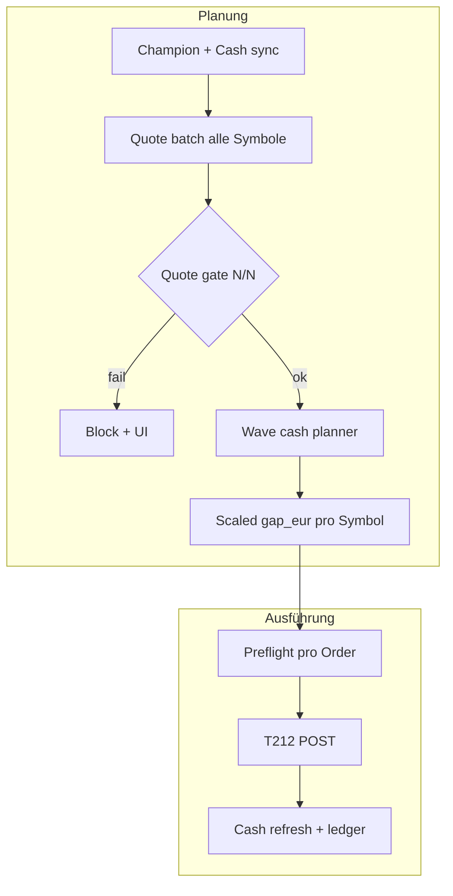

# Live-Trading / Champion-Rebalance — Remediation Plan

**Status:** Entwurf (2026-06-02) — **Phase 0–5 abgeschlossen** (2026-06-02)  
**Ziel:** Volle Champion-Portfolio-Welle mit **echten, broker-tauglichen Preisen** und **Cash-Planung**, die zum Modell passt.  
**Auslöser:** 3/13 Käufe erfolgreich; Rest `NO_LIMIT_PRICE`, `Insufficient funds`, falsche 187-€-Kappungen.

---

## 1. Ist-Analyse (kurz)

| Ebene | Problem |
|-------|---------|
| **Kurse** | `live_quote_engine` nutzt Yahoo (`READONLY_YFINANCE`); nur **8** Symbole in `INSTRUMENT_DEFS`, Champion hat **13**. Yahoo liefert falsche Rohpreise → `quote_plausibility` cappt auf 187 €. |
| **T212** | Offizielle **Public API v0** hat **kein** dokumentiertes REST-Quote-Endpoint; erlaubt sind u. a. `GET /equity/positions` (mit `currentPrice`) und `GET /equity/metadata/instruments` (Metadaten, Refresh ~10 min). |
| **Cash** | Modell skaliert Summe der EUR-Ziele auf deployable Cash (~467 € bei 492 €). Ausführung sendet **pro Symbol volles `gap_eur`** sequentiell, ohne **Wellen-Summen-Check** und ohne **Pro-rata**. |
| **Scope** | MU fehlte in `managed_scope_policy.json`. |
| **UX** | Kein klares „X/Y Orders, Grund: …“ vor/nach Senden. |

---

## 2. T212: Was gibt es wirklich?

### 2.1 Offizielle Public API (docs.trading212.com, v0, Beta)

| Endpoint | Nutzen für Preise | Rate limit |
|----------|-------------------|------------|
| `GET /equity/positions` | **`currentPrice` / `currentValue`** für **bestehende** Positionen | 1 / 1s |
| `GET /equity/metadata/instruments` | Ticker, ISIN, Typ, Währung — **Preisfeld in Doku nicht garantiert**; Spike nötig | 1 / 50s |
| `GET /equity/account/cash` | `availableToTrade` für Sizing (bereits genutzt) | — |
| `GET /equity/orders` | Pending-Reservierung (bereits `planning_cash`) | 1 / 5s |

**Nicht** in der offiziellen Doku: `GET /equity/quote` o. ä. für Live-Bid/Ask aller Symbole.

### 2.2 Was „T212-Kurse“ in der Praxis bedeutet

1. **Primär (vor Kauf, leeres Depot):** Spike: Antwort von `metadata/instruments` parsen — falls `lastPrice` / LTP / ähnlich vorhanden → **T212-Preis-Adapter** bauen.  
2. **Für gehaltene Titel:** `positions.currentPrice` → EUR via FX (bereits im Stack).  
3. **Fallback:** Yahoo nur mit **validiertem** `provider_symbol` + Strenge Plausibilität; **kein** Order ohne bestätigten Preis.  
4. **Optional Phase 4:** WebSocket Bid/Ask (Community-Clients, **nicht** offizielle REST-Doku) — nur nach Spike und Rate-Limit-Design.

**Repo-Hook:** Allowlist enthält bereits `/equity/metadata/instruments` (`t212_official_endpoint_registry.py`, `t212_request_allowlist.py`). Execution-Client kann `get_json` für Readonly-GET erweitern.

---

## 3. Zielarchitektur



**Prinzipien**

- **Fail-closed:** Keine Champion-Welle wenn nicht **mindestens** alle geplanten BUY-Symbole einen **T212- oder validierten** EUR-Preis haben.  
- **Ein Cash-Pool:** `Σ scaled_notional ≤ planning_cash_eur` vor der Schleife.  
- **T212 ticker:** Immer `*_US_EQ` aus `t212_instrument_mapper`, nie `STX_US` als Symbol-Key.

---

## 4. Phasenplan

### Phase 0 — Spike & Spezifikation (0,5–1 Tag)

| # | Aufgabe | Ergebnis |
|---|---------|----------|
| 0.1 | Live/Demo: `GET /equity/metadata/instruments` (ggf. gefiltert) JSON sample speichern unter `evidence/t212_instruments_sample.json` | Feldliste für Preis |
| 0.2 | `GET /equity/positions` mit offenen Positionen sample | `currentPrice`-Mapping |
| 0.3 | Entscheid dokumentieren: **T212-only** vs **T212 + Yahoo fallback** | `docs/T212_QUOTE_SOURCE_DECISION.md` |
| 0.4 | Tool `tools/run_t212_phase0_quote_spike.py` + Tests | `evidence/t212_*`, Cache bei 429 |

**Exit:** Klarheit, ob REST-Metadaten für Pre-Sizing reichen. **Ergebnis:** Pre-buy → `T212_METADATA_NO_PRICE_USE_YAHOO_VALIDATED`; gehalten → `walletImpact.currentValue / quantity`; kein REST-Quote-Endpoint.

**Artefakte:** `evidence/t212_instruments_sample.json`, `evidence/t212_champion_instruments_verified.json`, `evidence/t212_positions_sample.json`, `evidence/t212_phase0_spike_summary.json`, `docs/T212_QUOTE_SOURCE_DECISION.md`.

---

### Phase 1 — Quote-Engine „T212-first“ (2–4 Tage)

| # | Modul | Änderung |
|---|--------|----------|
| 1.1 | `integrations/trading212/t212_instrument_quotes.py` (neu) | `fetch_quotes_for_tickers(root, t212_ids[]) → Dict[sym, price_eur]`; Rate-Limits; Cache 30–60s |
| 1.2 | `market/live_quote_engine.py` | Provider-Kette: **T212 → positions (wenn held) → Yahoo fallback**; Snapshot-Felder `price_source_by_symbol` |
| 1.3 | `paper/p16d/instrument_identity.py` | `INSTRUMENT_DEFS` / Champion-CSV sync: **alle 13** Symbole (GOOGL, GOOG, AMD, CAT, ON, VRT, TXN, MU, …) |
| 1.4 | `paper/p16d/quote_plausibility.py` | Bei `source=T212`: **keine** 187-€-Cap-Verschärfung; bei Yahoo: Cap + **block** statt 85 %-Fake-Limit für Orders |
| 1.5 | `execution/.../limit_price_for_symbol` | Nur EUR-Preis aus Snapshot; **kein** Fallback auf fremdes Symbol |

**Tests:** `tests/test_t212_instrument_quotes.py`, `tests/test_live_quote_champion_coverage.py` (13/13).

**Exit:** Snapshot `executable_prices_eur` enthält alle Champion-Symbole mit `source` ∈ {T212, YAHOO_VALIDATED}.

**Umsetzung (2026-06-02):** `integrations/trading212/t212_instrument_quotes.py`, T212-first-Merge in `market/live_quote_engine.py`, 13/13 `INSTRUMENT_DEFS`, Order-sichere `quote_plausibility` (kein 85%-Fake-Limit), `limit_price_for_symbol` ohne `fallback_eur`.

**Tests:** `tests/test_t212_instrument_quotes.py`, `tests/test_live_quote_champion_coverage.py` (13/13 grün).

---

### Phase 2 — Cash-Wellen-Planer (1–2 Tage)

| # | Modul | Änderung |
|---|--------|----------|
| 2.1 | `execution/confirmed_live/rebalance_wave_planner.py` (neu) | Input: orders[], `planning_cash_eur`; Output: orders mit `scaled_notional_eur`, `scale_factor` |
| 2.2 | Logik | `planning_cash = resolve_planning_cash_eur(...)`; `factor = min(1, cash / sum(gaps))`; optional Mindest-Order 5 € streichen |
| 2.3 | `try_execute_walkforward_rebalance_now` | Vor der Schleife Planner aufrufen; **nur** skalierte Notional |
| 2.4 | `build_live_order_preflight` | Zeigt **skaliertes** Notional + verbleibendes Cash |

**Tests:** 13 Orders, 500 € Cash, 470 € Summe → factor ≈ 1; 470 € bei 200 € Cash → factor ≈ 0,43 auf alle.

**Exit:** Modell-Summe und Ausführungs-Summe konsistent.

**Umsetzung (2026-06-02):** `execution/confirmed_live/rebalance_wave_planner.py`; Integration in `try_execute_walkforward_rebalance_now`, Champion-Batch, Enqueue; Preflight zeigt skaliertes Volumen.

**Tests:** `tests/test_rebalance_wave_planner.py`.

---

### Phase 3 — Harte Gates & Ausführung (1–2 Tage)

| # | Aufgabe |
|---|---------|
| 3.1 | `execute_live_rebalance`: nach Quote-Refresh `require_champion_quote_coverage(root, symbols)` |
| 3.2 | UI `live_trading_dashboard`: vor „Champion-Portfolio senden“ Anzeige **„13/13 Kurse OK“** oder Block |
| 3.3 | `ensure_plan_symbols_in_scope`: MU + alle Champion-Symbole automatisch |
| 3.4 | Ergebnis-Report: `executed`, `failed`, `skipped_no_price`, `skipped_preflight` mit DE-Text |
| 3.5 | Rate-Limit: Limit-Orders 2s; Market 50/min — Welle dauert ~30–60s (akzeptabel) |

**Exit:** Kein stiller Partial-Run ohne Meldung.

**Umsetzung (2026-06-02):** `market/champion_quote_gate.py`, `analytics/execution_result_report.py`, Gate in `execute_live_rebalance` + Dashboard-UI, `ensure_plan_symbols_in_scope` für alle 13 Champion-Symbole.

**Tests:** `tests/test_champion_quote_gate.py`, `tests/test_execution_result_report.py`.

---

### Phase 4 — Optional T212 WebSocket / LTP (nach Bedarf)

Nur wenn Phase 0 zeigt: REST-Metadaten **ohne** brauchbaren Preis.

- Separater Service `t212_price_stream` (out of scope für EXE v1).  
- Bid/Ask für `*_US_EQ` in Snapshot schreiben.  
- Eigenes Rate-Limit / Reconnect / Evidence.

---

### Phase 5 — Validierung & Release (1 Tag)

| # | Aufgabe |
|---|---------|
| 5.1 | pytest: quote + wave + walkforward integration |
| 5.2 | Dry-run / Paper: `AA_EXECUTION_DRY_RUN=1` volle Welle simulieren |
| 5.3 | Ein Live-Run US-Session: Evidence `evidence/live_trading_operations_latest.json` mit `executed` ≈ N, `quote_coverage: 13/13` |
| 5.4 | `tools/build_v5r_standalone_exe.py` + SHA256 |

**Umsetzung (2026-06-02):** `tools/validate_live_rebalance_phase5.py`, `tests/test_live_rebalance_pipeline_integration.py`, Evidence `evidence/v5r_live_rebalance_phase5_validation.json`, Report `docs/LIVE_TRADING_REBALANCE_PHASE5_VALIDATION.md`.

**Ausführen:** `.venv\Scripts\python.exe tools\validate_live_rebalance_phase5.py` (optional `--build-exe`).

---

## 5. Akzeptanzkriterien

1. **Quote coverage:** Vor Senden ≥ **100 %** der geplanten BUY-Symbole mit Preis, Quelle dokumentiert.  
2. **Kein 187-€-Sizing** für STX/WDC/CIEN, wenn Rohpreis Yahoo falsch war (Order blockiert oder T212-Preis).  
3. **Cash:** `sum(submitted_notional) ≤ planning_cash` (mit Toleranz 2 %).  
4. **Transparenz:** UI/Evidence: „8/13 gesendet — 5 ohne Kurs“ oder „13/13 gesendet“.  
5. **Champion unverändert:** Keine Änderung an Signal-Gewichten / Risk-off (nur Infrastruktur).

---

## 6. Risiken & Mitigation

| Risiko | Mitigation |
|--------|------------|
| T212-Metadaten ohne Live-Preis | Yahoo-Fallback + harte Blockade; Phase 4 WebSocket |
| Rate limit 1 req / 50s instruments | Cache; gezielte Ticker-Filter wenn API `ticker=` unterstützt (Spike); nicht volle Liste bei jedem Klick |
| Yahoo weiter falsch | ISIN/T212-Ticker-Mapping aus `metadata/instruments` |
| Broker lehnt trotzdem ab | Weiter `record_stock_buy_attempt`; UI zeigt T212-Fehler pro Symbol |

---

## 7. Reihenfolge (empfohlen)

```text
Phase 0 (Spike) → Phase 1 (Quotes) → Phase 2 (Cash) → Phase 3 (Gates/UI) → Phase 5 (Test/EXE)
                              ↘ Phase 4 nur bei Spike-Fail
```

**Schnellster Nutzen:** Phase 1 + 2 — behebt 187-€-Bug und „Cash nach 3 Orders weg“.

---

## 8. Dateien (voraussichtlich betroffen)

| Bereich | Dateien |
|---------|---------|
| T212 Quotes | `integrations/trading212/t212_instrument_quotes.py`, `t212_confirmed_execution_client.py`, `t212_official_endpoint_registry.py` |
| Quotes | `market/live_quote_engine.py`, `paper/p16d/instrument_identity.py`, `paper/p16d/quote_plausibility.py` |
| Cash | `execution/confirmed_live/rebalance_wave_planner.py`, `us_equity_deferred_intents.py`, `planning_cash.py` |
| Plan/UI | `analytics/live_trading_operations.py`, `ui/live_trading_dashboard/service.py`, `window.py` |
| Scope | `analytics/pilot_investment_plan.py` (`ensure_plan_symbols_in_scope`), `managed_scope_policy.json` |
| Tests | `tests/test_t212_*`, `tests/test_rebalance_wave_planner.py`, `tests/test_order_execution_fixes.py` |

---

## 9. Nächster konkreter Schritt (automatisch umsetzbar)

1. **Phase 0.1** ausführen: Instrument-Metadaten-Sample von T212 holen und Preisfelder prüfen.  
2. Danach **Phase 1.1–1.4** implementieren.

*Referenz Evidence:* `evidence/live_trading_operations_latest.json`, `live_pilot/confirmed_execution/submitted_orders/`, `docs.trading212.com/api`.
