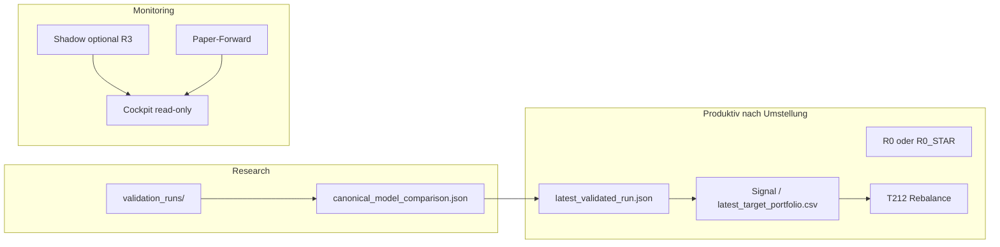

# Langfristige Umstellung auf R0_LEGACY_ENSEMBLE (und optional R0*)

**Stand:** 2026-06-04  
**Status:** IN_PROGRESS — M0 COMPLETE, M1 IN_PROGRESS (siehe `control/r0_migration/phase_status.json`); kein produktiver Champion-Wechsel  
**Vollständige Checkliste:** `docs/R0_MIGRATION_MASTER_CHECKLIST.md` (M0–M12 inkl. EXE & OS)  
**Aktueller Champion (unverändert bis Freigabe):** `R3_w075_q065_noexit`  
**Ziel-Champion (vorgeschlagen):** `R0_LEGACY_ENSEMBLE` oder nachgewiesenes **`R0_STAR`** (getuntes R0, gleiche Risk-off-Philosophie `legacy`/`legacy`)

---

## 0. Ziel und Nicht-Ziele

### Ziel

Langfristig das **produktive Signal- und Portfolio-Modell** von R3 (Risk-off Momentum Rescue) auf **R0** (volles ML-Ensemble, klassisches Risk-off) umstellen — **nur** wenn:

1. Evidenz auf **einem Kalender** R0 (oder R0*) den Champion **schlägt** oder die gewählte Zielfunktion erfüllt,
2. alle Gates in `control/champion_change_criteria.yaml` **PASS**,
3. ein echtes `EXTERNAL_REVIEW_APPROVAL_CHAMPION_CHANGE_*.md` existiert (kein Template),
4. Shadow/Paper-Forward die Live-Tauglichkeit stützen.

### Nicht-Ziele (ohne separate Freigabe)

- Auto-Promotion oder stiller Pointer-Wechsel
- Änderung produktiver Signal-Gewichte / Risk-off-Parameter **während** der Evidenzphase (nur in `validation_runs/` / Research)
- Echtgeld-Orders oder Massen-Paper ohne Freigabe
- R5 / `rank_only` als Champion
- Sofortiger Abbruch der R3-Linie ohne Rollback-Artefakte

### Strategischer Hintergrund (Kurz)

| Modell | Matrix-Sharpe (~1860d) | CAGR (Matrix) | Rolle heute |
|--------|------------------------|---------------|-------------|
| R0 | **0,984** (Leader) | **19,9 %** | Sibling / Ziel |
| M1 | 0,983 | 19,9 % | Kontrolle |
| R3 | 0,923 | 19,3 % | **Champion** |
| MOM_63 | ~1,03 (2019–2026, anderer Rahmen) | ~22,6 % | Challenger |

Die Umstellung ist **ökonomisch** plausibel (höherer Sharpe/CAGR auf Matrix), aber **governance- und evidenzpflichtig**.

---

## 1. Leitprinzipien

1. **Eine Wahrheit pro Kalender** — kein Ranking ohne gemeinsame `daily_returns.csv`-Schnittmenge.
2. **Fail-closed** — widersprüchliche Pointer, verunreinigte `model_output`-Returns (2450-Tage-Mix) blockieren Entscheidungen.
3. **Zwei Spuren:**  
   - **Spur A (Hauptziel):** R0 → optional **R0\*** (getunt, weiterhin `legacy`/`legacy`).  
   - **Spur B (optional):** Hybrid / MOM-Sleeve — nur wenn Spur A die CAGR-Lücke zu MOM nicht schließt.
4. **R3 bleibt produktiv**, bis M9 abgeschlossen und extern freigegeben.
5. **Operative Konsistenz:** `AA_ALPHA_MODEL_MODE=ensemble` überall; kein `rank_only`-Drift.

---

## 2. Zielarchitektur (Endzustand)



**Artefakte nach Umstellung:**

| Artefakt | Inhalt |
|----------|--------|
| `control/authorization/champion_lineage_status.json` | `R0_LEGACY_ENSEMBLE` oder `R0_STAR_…` |
| `latest_validated_run.json` | variant_id, run_id, run_dir **konsistent** |
| `model_output_sp500_pit_t212/` | nur Ziel-Champion-Output |
| `evidence/canonical_model_comparison.json` | R0 als CHAMPION-Rolle |
| `docs/CHAMPION_STRATEGIC_DECISION_RECORD.md` | ADR: Wechsel E2/E3 → R0 |

---

## 3. Phasenplan (M0–M12)

Geschätzte Gesamtdauer: **3–6 Monate** bis M9 (parallelisierbar in M2–M5; Rechnerzeit für Matrix dominant). **M10–M12** nach Champion-Freigabe: Stabilisierung + EXE/OS-Rollout (**1–2 Wochen** technisch).

| Phase | Kurzname | Produktiv-Champion |
|-------|----------|-------------------|
| M0–M8 | Evidenz & Vorbereitung | R3 |
| M9 | Cutover Signale/Pointer | **→ R0** |
| M10 | Stabilisierung | R0 |
| M11 | EXE Marktanalyse | R0 (Anzeige) |
| M12 | OS / BAT / Desktop | R0 |

---

### M0 — Mandat & Zielfunktion (1 Woche, menschengeführt) — **ABGESCHLOSSEN 2026-05-31**

**Ziel:** Schriftliche Entscheidung, *was* „besser“ heißt nach der Umstellung.

**Deliverables:** `docs/R0_MIGRATION_MANDATE.md`, `control/r0_migration/mandate.json`, `control/champion_decision_charter_r0_target_draft.md`, `tools/run_r0_migration_phase_m0.py`

| # | Aufgabe | Deliverable |
|---|---------|-------------|
| M0.1 | Zielfunktion festlegen | Primär: **aligned Sharpe + CAGR**; Sekundär: MaxDD ≤ Champion+2pp; optional: Segment-3-Stabilität |
| M0.2 | Ziel-Variante wählen | **R0 pur** vs. **R0\*** (getunt) vs. später Hybrid |
| M0.3 | Charter-Update vorbereiten | Entwurf `control/champion_decision_charter.md` (R0-Hypothese statt R3-Rescue) |
| M0.4 | Risiko-Appetit | Akzeptanz: schlechteres Verhalten in Risk-off-Episoden? (explizit ja/nein) |

**Exit:** `docs/R0_MIGRATION_MANDATE.md` (1–2 Seiten) vom Owner unterzeichnet / in `control/` referenziert.

**Stop-Kriterium:** Wenn Mandat „Risk-off Rescue trotz schlechterem Sharpe“ bleibt → **kein** R0-Cutover; Plan stoppen oder nur Shadow.

---

### M1 — Evidenz-Baseline & Sanierung (1–2 Wochen) — **IN_PROGRESS (Matrix läuft)**

**Ziel:** Alle Vergleiche sind technisch möglich (baut auf Phase A/B aus `CHAMPION_EVIDENCE_GOVERNANCE_IMPROVEMENT_PLAN.md` auf).

**Deliverables:** `tools/run_r0_migration_phase_m1.py`, `control/r0_migration/m1_backtest_waiver.json`, `evidence/r0_migration/*`  
**Vorbereitung:** `--execute-preparation` gestartet (2026-06-04) — Validation Matrix R0/R3/M1, turbo-Profil.  
**Abschluss:** automatisch via `--wait-matrix` (Hintergrund) oder manuell nach Matrix-Ende: `python tools/run_r0_migration_phase_m1.py`

| # | Aufgabe | Tool / Pfad | Output |
|---|---------|-------------|--------|
| M1.1 | Pointer-Audit | Grep + `tools/backfill_validated_run.py` | `evidence/r0_migration/pointer_audit.json` |
| M1.2 | `validation_runs/` wiederherstellen | `tools/run_validation_matrix.py` (volle Matrix oder R0+R3+M1) | PASS-Runs unter `validation_runs/*_R0_LEGACY_ENSEMBLE/` |
| M1.3 | Frische Returns pro Variante | `strategy_daily_returns.csv` + SHA256 | `evidence/r0_migration/returns_manifest.json` |
| M1.4 | `model_output` entkoppeln | Kein Champion-Metrik-Read aus 2450-Tage-CSV | `evidence/calendar_mismatch_root_cause.md` (aktualisiert) |
| M1.5 | Env-Audit | `active_alpha_*.bat`, Signal-Jobs | `evidence/r0_migration/env_alpha_model_mode_audit.json` — muss `ensemble` sein |

**Exit:**

- R0, R3, M1: jeweils `returns_path` + `integrity_pass: true`
- `validation_runs_present: true` in Canonical-Rebuild

**Tests:** `tests/test_champion_governance_phase_d.py`, `tests/test_g0r_remediation.py` (erweitern um R0-Pfade).

---

### M2 — Einheitlicher Vergleichsrahmen (2–3 Wochen)

**Ziel:** R0 vs. R3 vs. M1 vs. MOM auf **identischen** Handelstagen.

| # | Aufgabe | Spezifikation |
|---|---------|--------------|
| M2.1 | Canonical Rebuild | `tools/build_canonical_model_comparison.py` oder Matrix-Pipeline |
| M2.2 | **Pflicht-Kalender** | Intersection ≥ 1859 Tage (2019–2026) **und** Matrix 1860d — **zwei Tabellen**, klar gelabelt |
| M2.3 | Metriken | Sharpe, CAGR, MaxDD, Vol, Turnover, Hit-Rate |
| M2.4 | Subperioden | 3 Segmente für **R0 und R3** (nicht nur MOM) |
| M2.5 | Episode-Attribution | Neues Tool `tools/build_risk_off_episode_comparison.py`: Metriken nur an `risk_on=false`-Tagen |

**Deliverables:**

- `evidence/r0_migration/aligned_comparison.json`
- `evidence/r0_migration/risk_off_episode_attribution.csv`
- `research_evidence/risk_off_episode_attribution.csv` (aktualisiert)

**Exit:**

- R0 schlägt R3 auf **beiden** dokumentierten Kalendern (Sharpe ≥ +0,02, DD nicht schlechter als +2pp vs. Kriterien-YAML)
- Episode-Report: dokumentiert, ob R3 in Stress **doch** gewinnt (entscheidet für Rollback-Story)

---

### M3 — R0-Optimierung (R0\*) — Research only (4–8 Wochen)

**Ziel:** Prüfen, ob **innerhalb** `legacy`/`legacy` noch Performance ohne Strategiewechsel holbar ist.

**Varianten-ID-Regel:** Solange `risk_off_selection_mode=legacy` und `risk_off_gate_mode=legacy` → bleibt Familie **R0**; andere IDs nur bei dokumentierten Config-Hashes (z. B. `R0_STAR_w40_g40_r20_top12`).

| Grid-Achse | Werte (Vorschlag) | Risiko |
|------------|-------------------|--------|
| Ensemble-Gewichte | 35/35/30, 30/40/30, 40/40/20 (Baseline) | Overfit |
| `top_k` | 12, 15, 18 | Konzentration / DD |
| `train_years` | 5, 7, 10 | Regime-Shift |
| `horizon` | 5, 10, 15 | Turnover |
| `rebalance_every` | 5, 10 | Kosten |
| Selection-Score | optional Code-Flag nur Research | Komplexität |

| # | Aufgabe | Output |
|---|---------|--------|
| M3.1 | Präregistriertes Grid | `research_evidence/r0_tuning_trial_ledger.json` |
| M3.2 | Batch-Runs | `validation_runs/R0_STAR_*` |
| M3.3 | Beste Variante wählen | Nur wenn **OOS-Segment 2+3** nicht kollabiert (Sharpe > 0,5) |
| M3.4 | DSR auf Grid | `control/evidence/multiple_testing_status.json` |

**Exit:** Ein **einziger** Kandidat `R0_STAR` (oder Entscheidung: Baseline-R0 reicht) schlägt R3 und M1 auf aligned calendar **und** schlägt reines R0 nicht um >0,01 Sharpe schlechter in Segment 2.

**Wichtig:** Keine Änderung an produktivem `BacktestConfig`-Default ohne M9.

---

### M4 — Challenger-Spur B: MOM & Hybrid (optional, 4–6 Wochen)

**Nur wenn M3 die CAGR-Lücke zu MOM_63 (>2 pp) nicht schließt.**

| # | Kandidat | Zweck |
|---|----------|--------|
| M4.1 | `MOM_63_TOP12_STRICT` | Return-Obergrenze im Haus |
| M4.2 | **Hybrid** (neu): R0-Portfolio + 20–40 % Mom-Sleeve in risk-on | ML + Trend |
| M4.3 | **Hybrid** (neu): R0 + R2-artig nur in risk-off | Stress |

**Deliverables:** `evidence/r0_migration/hybrid_research_summary.md`  
**Exit:** Entscheidung: Ziel bleibt **R0/R0\*** **oder** neuer Strategietyp (erfordert **breitere** externe Freigabe).

---

### M5 — Kosten, Robustheit, Statistik (3–4 Wochen)

**Ziel:** Alle `champion_change_criteria.yaml`-Gates **evaluierbar → PASS** für den Ziel-Kandidaten.

| Gate | Maßnahme | Artefakt |
|------|----------|----------|
| Cost-Stress +25 bps | Eigener Turnover pro Kandidat | `control/evidence/cost_stress_status.json` |
| DSR ≥ 0,95 | Trial Ledger + `aa_multiple_testing_adjustment` | `control/evidence/multiple_testing_status.json` |
| Robustness | Subperiod **STABLE_POSITIVE** | `control/evidence/robustness_status.json` |
| Turnover | G1-Logik, keine Champion-Proxies | `evidence/g1_independent_next_level/` |

**Tools:** `tools/generate_research_evidence_reports.py`, `run_active_alpha_riskoff_followup.py` (K0–K3 für R0), ggf. `tools/chain_m1_then_cost_stress.py`.

**Exit:** `evidence/r0_migration/gate_matrix.json` — Ziel-Kandidat alle PASS; R3 dokumentiert als zurückgestellt.

---

### M6 — Shadow-Monitoring (6–8 Wochen Kalenderzeit)

**Ziel:** Live-Signale R0 parallel zu R3, **ohne** Orders vom Challenger.

| # | Aufgabe | Konfiguration |
|---|---------|---------------|
| M6.1 | `shadow_challenger_id` | `R0_LEGACY_ENSEMBLE` oder `R0_STAR` |
| M6.2 | Mindest-Outcomes | ≥ 30 (`champion_change_criteria.yaml`) |
| M6.3 | Drift-Alarme | Abweichung Gewichte / Turnover / Exposure |
| M6.4 | Cockpit | Read-only Panel „Migration Shadow“ |

**Artefakt:** `control/evidence/shadow_monitor_status.json`  
**Exit:** Shadow PASS; keine FAILSAFE-Drift über 14 Tage.

---

### M7 — Paper-Forward (8–12 Wochen Kalenderzeit)

**Nur mit expliziter Freigabe für Paper-Jobs** (kein Echtgeld).

| # | Aufgabe | Kriterium |
|---|---------|-----------|
| M7.1 | Paper-Pipeline auf R0-Konfiguration | ≥ 60 Forward-Tage |
| M7.2 | Vergleich zu R3-Paper (falls vorhanden) | Dokumentierte Delta-Metriken |
| M7.3 | Execution-Qualität | Quote-Coverage, Symbol-Normalisierung, Gebühren-Spalte |

**Exit:** `control/evidence/paper_monitor_status.json` PASS.

---

### M8 — Operative Vorbereitung (2–3 Wochen)

**Ziel:** Technischer Cutover ohne Signalunterbrechung.

| # | Aufgabe | Details |
|---|---------|---------|
| M8.1 | Runbook | `docs/R0_PRODUCTION_CUTOVER_RUNBOOK.md` |
| M8.2 | Config-Profile | `config/champion_r0_production.json` (oder env-Block in `.bat`) |
| M8.3 | Launcher / Cockpit | `aa_variant_id`, Governance-Strings, Marktanalyse-Snapshot |
| M8.4 | Regression-Tests | `tests/test_p0_safety_control_plane.py`, Pilot-Refresh, Champion-Guard |
| M8.5 | Rollback-Paket | Pointer + Config auf R3 frozen unter `control/rollback/r3_last_known_good/` |
| M8.6 | Cockpit-Strings / Snapshot-Vorbereitung | R0 in Review-Snapshot (read-only), **kein** EXE-Build |

**Exit:** Trockenlauf: ein vollständiger Signal-Lauf erzeugt `latest_target_portfolio.csv` aus R0-Run — **noch nicht** produktiv geschaltet.

**Hinweis:** EXE-Build und OS-Cutover sind **nicht** Teil von M8 — siehe **M11** und **M12** (nach M9).

---

### M9 — Externe Freigabe & Champion-Wechsel (1–2 Wochen)

**Ziel:** Legitimer Wechsel.

| # | Schritt | Pflicht |
|---|---------|---------|
| M9.1 | Review-Paket | ZIP: Canonical, Gates, Shadow, Paper, ADR, Runbook |
| M9.2 | `EXTERNAL_REVIEW_APPROVAL_CHAMPION_CHANGE_<date>.md` | Echtes Dokument, kein `TEMPLATE_` |
| M9.3 | Pointer-Update | `latest_validated_run.json`, `champion_lineage_policy.json`, Registry |
| M9.4 | Reports | `challenger_report`, `background_research_status` — Champion = R0 |
| M9.5 | Strategisches ADR | `docs/CHAMPION_STRATEGIC_DECISION_RECORD.md` Option **E3 → R0** |
| M9.6 | Erste produktive Signale | Ein autorisiertes Cutover-Fenster |

**Exit:** `champion_change_executed: true` in `control/champion_strategic_decision.json`; Auto-Promotion bleibt **false**.

---

### M10 — Stabilisierung & R3-Archiv (laufend, 3 Monate)

| # | Aufgabe |
|---|---------|
| M10.1 | R3 als **frozen sibling** in Matrix behalten (kein Löschen) |
| M10.2 | Monatlicher Canonical-Refresh |
| M10.3 | Post-Mortem: Episode-Attribution live vs. Backtest |
| M10.4 | Entscheidung Spur B (MOM/Hybrid) schließen oder neues Programm |
| M10.5 | Incident-/Rollback-Übungen gegen `control/rollback/r3_last_known_good/` |

**Exit:** 3 Monate ohne Pointer-Konflikt; Shadow optional R3 weiter dokumentiert.

---

### M11 — EXE (Marktanalyse Decision Cockpit) (1–2 Wochen, **nach M9.2**)

**Ziel:** Read-only Cockpit zeigt R0-Champion, Gates und Migration-Status; **keine** neue Signalberechnung in der EXE.

| # | Aufgabe | Tool / Pfad |
|---|---------|-------------|
| M11.1 | Review-Snapshot auf R0 | `control/review_snapshot/`, `tools/refresh_v5r_live_cockpit.py` |
| M11.2 | Viewmodel / Governance-DE | `aa_decision_cockpit_viewmodel.py` |
| M11.3 | PyInstaller Build | `tools/build_v5r_standalone_exe.py` → `dist/Marktanalyse.exe` |
| M11.4 | Static + Runtime Verify | `tools/static_verify_v5r_standalone_exe.py`, `tools/v5r_runtime_smoke_test.py` |
| M11.5 | Provenance & SHA256 | `Marktanalyse.exe.sha256`, `build/decision_cockpit/v5r_build_provenance.json` |
| M11.6 | Externe EXE-Abnahme | Review-ZIP (`tools/build_v5r_final_review_zip.py`) |

**Exit:** Runtime fail-closed PASS; EXE-Hash dokumentiert; separates `EXTERNAL_REVIEW_APPROVAL_*` falls Build-Phase es verlangt.

**Nicht:** `setup_operational_marktanalyse.py` (deprecated) — Start über `run_v5r_decision_cockpit.bat` / `run_pilot_start.bat`.

---

### M12 — OS / Windows / Betriebs-Rollout (1–3 Tage, **nach M9**, ideal mit M11)

**Ziel:** Desktop, Autostart und Signal-BATs konsistent mit R0; Rollback auf R3 in < 1 Handelstag.

| # | Aufgabe | Details |
|---|---------|---------|
| M12.1 | OS-Runbook | `docs/R0_OS_ROLLOUT_RUNBOOK.md` (anlegen bei M8.1) |
| M12.2 | Env-Kette | `active_alpha_user_config.bat`, `active_alpha_settings.bat`, `load_active_alpha_config.bat` — `ensemble`, R0 `legacy`/`legacy` |
| M12.3 | Startup | `setup_active_alpha_startup.bat` |
| M12.4 | Cockpit-Launcher | `run_v5r_decision_cockpit.bat`, `run_pilot_start.bat` |
| M12.5 | Ops / Sector | `tools/run_ops_refresh.py`, T212-Gebühren-Spalte |
| M12.6 | Alte Artefakte | Backup, dann alte EXE/`_internal` entfernen |
| M12.7 | Rollback-Paket OS | R3-`.bat` + vorherige EXE unter `control/rollback/r3_last_known_good/` |

**Exit:** Ein dokumentiertes Rollout-Fenster; SHA256 der produktiven EXE auf dem Ziel-PC verifiziert.

---

## 4. Entscheidungsmatrix (Go / No-Go)

| Prüfung | Go | No-Go |
|---------|-----|-------|
| M0 Mandat | Sharpe/CAGR-Priorität | Risk-off-Rescue bleibt #1 |
| M2 aligned | R0 ≥ R3 + 0,02 Sharpe, DD ok | R3 gewinnt auf aligned |
| M2 Episoden | R0 nicht katastrophal in risk-off | R0 DD in Episoden >> +2pp |
| M5 Gates | alle PASS | Cost oder DSR FAIL |
| M6 Shadow | PASS | Drift / FAILSAFE |
| M7 Paper | PASS (wenn vorgeschrieben) | Forward unter R3 |
| M9 extern | Seal vorhanden | nur Template |
| M11 EXE | Runtime + static PASS | fail-closed FAIL |
| M12 OS | Env + Launcher konsistent | Rollback nicht getestet |

---

## 5. Rollback

**Auslöser:** Shadow-FAIL, Paper-DD > Schwelle, Pointer-Konflikt, fehlende Evidenz, externes Revoke.

**Schritte (< 1 Handelstag):**

1. `latest_validated_run.json` → `control/rollback/r3_last_known_good/`
2. Env / Config auf R3-Parameter (`mom_blend_blend`, w=0,75, q=0,65)
3. Signal-Lauf aus R3-Run
4. Incident-Report unter `evidence/r0_migration/rollback_<date>.json`

---

## 6. Risiken & Mitigationen

| Risiko | Mitigation |
|--------|------------|
| Overfit R0\*-Grid | Präregistriertes Ledger, Segment-2-Pflicht, DSR |
| MOM-Lücke bleibt | M4 Hybrid nur mit extra Freigabe |
| `model_output`-Kontamination | M1.4 harte Sperre in Code/Tests |
| rank_only-Drift | M1.5 + CI-Check auf `ensemble` |
| Governance-Konflikt AGENTS.md | Kein Cutover ohne M9.2 |
| Lange Matrix-Laufzeit | Shared cache, `--resume` Matrix |

---

## 7. Tool- & Datei-Index

| Phase | Primäre Tools |
|-------|----------------|
| M1 | `tools/run_validation_matrix.py`, `tools/backfill_validated_run.py` |
| M2 | `tools/build_canonical_model_comparison.py`, **neu:** `tools/build_risk_off_episode_comparison.py` |
| M3 | `run_active_alpha_riskoff_experiments.py` (R0-Grid), `validation_runs/` |
| M5 | `tools/generate_research_evidence_reports.py`, `run_active_alpha_riskoff_followup.py` |
| M6 | `aa_shadow_champion`, `tests/test_p4_shadow_champion.py` |
| M7 | `tools/run_p12c_forward_paper_trading.py` (mit Freigabe) |
| M8 | `tools/run_champion_signal_update.py`, `analytics/champion_runtime_guard.py` |
| M11 | `tools/build_v5r_standalone_exe.py`, `tools/static_verify_v5r_standalone_exe.py`, `tools/v5r_runtime_smoke_test.py` |
| M12 | `setup_active_alpha_startup.bat`, `run_v5r_decision_cockpit.bat`, `tools/run_ops_refresh.py` |

**Referenzen:**

- `control/champion_change_criteria.yaml`
- `docs/CHAMPION_EVIDENCE_GOVERNANCE_IMPROVEMENT_PLAN.md` (Phase A–G Basis)
- `docs/CHAMPION_STRATEGIC_DECISION_RECORD.md` (wird bei M9 aktualisiert)
- `evidence/canonical_model_comparison.json`

---

## 8. Empfohlene Reihenfolge (kritisch)

```text
M0 → M1 → M2 → (M3 ∥ M5 Teil) → M5 vollständig → M6 → M7 → M8 → M9 → M10
              ↘ M4 nur bei CAGR-Lücke ↗
Nach M9:  M11 (EXE) + M12 (OS)  — ein Release-Fenster empfohlen
```

**Parallele Arbeit:** M3 (Tuning) und M5 (Cost auf Baseline-R0) nach M2 starten; M6 erst nach M5 PASS für Ziel-Kandidat. **M11/M12** erst nach `EXTERNAL_REVIEW_APPROVAL_CHAMPION_CHANGE_*.md`.

---

## 9. Sofort nächste Schritte (Woche 1)

1. **M0.1–M0.2** — Zielfunktion und R0 vs. R0\* schriftlich festhalten.  
2. **M1.2** — `validation_runs` für `R0_LEGACY_ENSEMBLE` und `R3_w075_q065_noexit` neu fahren.  
3. **M1.5** — Env auf `ensemble` prüfen/korrigieren.  
4. **M2.5** — Episode-Tool spezifizieren (Issue/Ticket in `DEVELOPMENT_PIPELINE`).

---

## 10. Offene Punkte (vor Start M3)

- [x] M0: Primär **R0**, Tuning **R0\*** in M3 (Mandat)  
- [x] M0: Paper-Forward **Pflicht**; Shadow **Pflicht**  
- [x] M0: Hybrid/MOM **M4 deferred**, nicht ausgeschlossen  
- [x] M0: EXE → **M11**, OS → **M12** (nach M9)
- [ ] M1: Matrix + `returns_manifest` integrity PASS
- [ ] M11/M12: Runbooks `R0_PRODUCTION_CUTOVER` + `R0_OS_ROLLOUT` (Entwurf in M8)

---

*Dieses Dokument autorisiert **keinen** Champion-Wechsel. Ausführung produktiver Parameter erst nach M9 und externem Seal. EXE/OS erst nach M9 in M11/M12.*
