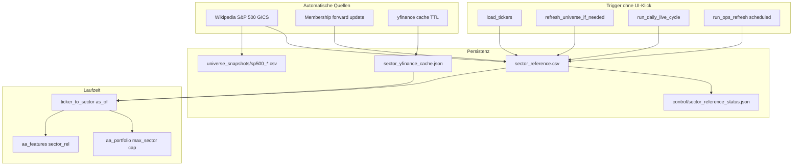

# Automatische Sektor-Referenz (PIT) — Implementierungsplan

**Stand:** 2026-06-03  
**Ziel:** Statische `SECTOR_MAP`-Pflege durch eine **vollautomatische**, versionierte Sektor-Referenz ersetzen (IPO-/Index-Neuzugänge ohne manuelle Updates), Anbindung an **Live-Dashboard**, **Marktanalyse.exe** und **OS-BAT**-Umgebung.  
**Champion (unverändert):** `R3_w075_q065_noexit` — keine Änderung an Signal-Gewichten, Risk-off-Parametern oder Promotion.

---

## 0. Problemstatement

| Thema | Ist-Zustand | Soll |
|-------|-------------|------|
| **Sektor-Lookup** | Feste `SECTOR_MAP` in `aa_constants.py` (~200+ Ticker) | Automatisch aus S&P-500-Universe-Refresh + begrenztem yfinance-Fallback |
| **IPO / Neuzugang** | Ticker → `Unknown` bis Handeintrag in Python-Dict | Beim nächsten Wikipedia/Membership-Refresh oder Signal-Lauf automatisch |
| **PIT / Backtest** | Grobe Map ohne `valid_from` | `sector_reference.csv` mit PIT-Zeilen; Backtest-Rebuild über Membership-Pipeline |
| **Live-Dashboard ①** | Nur T212-Sync + Mark-Zähler | Zusätzlich Sektor-Referenz-Refresh (wenn Cache stale) |
| **EXE / OS** | Gleiche Env, kein Sektor-Hook | `AA_SECTOR_*` in `active_alpha_marktanalyse_os.bat`; EXE ruft dieselben Hooks |
| **Transparenz** | Pilot-UI zeigt „Sektor (Modell)“ ohne Herkunft | Status: `as_of`, Coverage Champion-14, Unknown-Count |

**Nicht im Scope (ohne separate Freigabe):**

- Änderung von `max_sector`, `gics_to_coarse`-Bucket-Definitionen (ökonomische Caps)
- Champion-Wechsel, Auto-Promotion, neue Alpha-Features
- Live-GICS-API bei jedem Tick (nicht reproduzierbar)

---

## 1. Leitprinzipien

1. **Automatisierung first:** Kein `sector_overrides.csv` als Hauptpfad; optional nur für Notfall-Quarantäne (out of scope Phase 1).
2. **Gleicher Rhythmus wie Universum:** Sektor-Refresh an `AA_TICKER_CACHE_MAX_AGE_DAYS` / `refresh_universe_if_needed` / `load_tickers` gekoppelt.
3. **PIT für Historie:** `valid_from` / `valid_to` pro Ticker; Lookup zum Rebalance-/Signal-Datum.
4. **Fail-closed bei Daten:** Wikipedia-Fetch fehlgeschlagen → Fallback `SECTOR_MAP` → `Unknown`; Status ROT/GELB im Dashboard.
5. **Audit:** Jeder Refresh schreibt `control/sector_reference_status.json` + optional `evidence/sector_reference_refresh_latest.json`.
6. **Champion-neutral:** Weniger `Unknown` = Stabilität; keine neue Alpha-Hypothese.

---

## 2. Zielbild (Architektur)



**Lookup-Kette (fest codiert):**

```
1. sector_reference.csv  (PIT: valid_from ≤ as_of ≤ valid_to)
2. sector_yfinance_cache.json  (nur für im Run vorkommende Ticker)
3. SECTOR_MAP  (Legacy-Fallback)
4. "Unknown"
```

**Grob-Buckets:** `config/gics_to_coarse.json` mappt GICS-Strings → bestehende Buckets (`Semiconductors`, `Financials`, …).

---

## 3. Phasenplan

### Phase S0 — Design & Gap-Analyse (0,5 Tag)

| # | Aufgabe | Output |
|---|---------|--------|
| S0.1 | Champion-14 + Top-100-Universum vs. `SECTOR_MAP` diff | `evidence/sector_map_gap_analysis.json` |
| S0.2 | Wikipedia-Parser: Spalten in Live-`aa_universe` vs. `build_sp500_membership_wikipedia` angleichen | Notiz in diesem Doc (Abschnitt 8) |
| S0.3 | Governance-Check: nur Infrastruktur, kein Champion-Parameter | Eintrag in `evidence/sector_reference_governance_note.json` |

**Exit:** Gap-Liste reviewed; CIEN und alle CHAMPION_SYMBOLS als Acceptance-Kriterium Phase S4.

**Status: ABGESCHLOSSEN (2026-06-03)**

| Artefakt | Pfad |
|----------|------|
| Gap-Analyse | `evidence/sector_map_gap_analysis.json` |
| Governance | `evidence/sector_reference_governance_note.json` |
| Parser-Abgleich | `evidence/sector_wikipedia_parser_alignment.json` |
| Generator | `tools/run_sector_reference_phase_s0.py` |

**S0.1 Ergebnis (Kurz):**

| Gruppe | Ticker | Unknown via `SECTOR_MAP` |
|--------|--------|-------------------------|
| Champion-14 | 14 | **1** (`CIEN`) |
| `sp500_latest` Snapshot | 503 | 0 |
| Membership aktiv (gesamt) | 503 | 0 |
| Membership Top-100-Proxy | 100 | 0 |
| `latest_target_portfolio` | 11 | 0 |

**S0.2:** Live `aa_universe._component_records_from_tables` liefert **kein** `sector_gics`; `build_sp500_membership_wikipedia.parse_current_constituents` schon. Phase S2 schließt diese Lücke.

**S0.3:** Klassifikation `INFRASTRUCTURE_ONLY`; Champion `R3_w075_q065_noexit` und Risk-off/α-Parameter unverändert.

**S0.4 Entscheidung:** `sector_reference.csv` **nicht** in Git (wie `universe_snapshots/`).

---

### Phase S1 — Datenmodul & PIT-CSV (1–2 Tage)

**Neue / geänderte Module:**

| Datei | Inhalt |
|-------|--------|
| `aa_sector_reference.py` | Kern-API (siehe Abschnitt 4) |
| `config/gics_to_coarse.json` | GICS → coarse sector (Version 1 aus heutiger `SECTOR_MAP`-Verteilung) |
| `sector_reference.csv` | Generiert, nicht handeditiert; in `.gitignore` oder committed als Snapshot (Entscheidung S0.4) |

**Empfehlung S0.4:** `sector_reference.csv` **nicht** in Git committen (wie `universe_snapshots/`); nur `sector_reference.csv.example` + generiertes Artefakt lokal/CI.

| # | Aufgabe | Tests |
|---|---------|-------|
| S1.1 | `parse_sector_gics_from_row()` + Unit-Tests mit Mock-DataFrame | `tests/test_sector_reference.py::test_gics_parse` |
| S1.2 | `update_sector_reference_from_records()` atomar (`aa_safe_io`) | `test_update_appends_valid_from` |
| S1.3 | `lookup_sector(ticker, as_of)` PIT-Logik | `test_pit_closes_old_row_on_sector_change` |
| S1.4 | `gics_to_coarse()` + unbekanntes GICS → `Unknown` oder nearest | `test_coarse_mapping` |
| S1.5 | `aa_constants.ticker_to_sector` → delegiert an `lookup_sector` | Bestehende Portfolio-Tests grün |

**Exit:** `pytest tests/test_sector_reference.py -q` grün; keine Änderung an Champion-Artefakten.

**Status: ABGESCHLOSSEN (2026-06-04)**

| Artefakt | Pfad |
|----------|------|
| Kernmodul | `aa_sector_reference.py` |
| GICS→Coarse | `config/gics_to_coarse.json` |
| Beispiel-CSV | `sector_reference.csv.example` |
| Seed (einmalig lokal) | `tools/seed_sector_reference_from_constants.py` |
| Tests | `tests/test_sector_reference.py` (7 Tests) |
| Delegation | `aa_constants.ticker_to_sector` → `lookup_sector` |
| Gitignore | `sector_reference.csv`, `sector_yfinance_cache.json` |

**Hinweis:** `ensure_sector_reference_fresh` ist Stub bis Phase S3; Lookup nutzt CSV (wenn vorhanden) → `SECTOR_MAP` → `Unknown`.

---

### Phase S2 — Universe-Pipeline (1 Tag)

| # | Datei | Änderung |
|---|-------|----------|
| S2.1 | `aa_universe.py` | `_component_records_from_tables`: Spalten `gics sector`, `sector` auslesen → `sector_gics` |
| S2.2 | `aa_universe.py` | `save_universe_snapshot`: Spalten `sector_gics`, `sector_coarse` (optional vorberechnet) |
| S2.3 | `aa_universe.py` | Ende `load_tickers()`: nach Membership-Update `update_sector_reference_from_records(...)` |
| S2.4 | `build_sp500_membership_wikipedia.py` | `build_asset_master` oder separater Schritt: Sektor aus `current` in `sector_reference` mit `valid_from` aus Membership |
| S2.5 | `aa_ops_refresh.py` | `refresh_universe_if_needed`: nach `save_universe_snapshot` Sektor-Update + `write_sector_reference_status` |

**Exit:** Ein Lauf `refresh_universe_if_needed` (Mock Wikipedia) erzeugt CSV + Status-JSON.

**Status: ABGESCHLOSSEN (2026-06-04)**

| # | Datei | Erledigt |
|---|-------|----------|
| S2.1 | `aa_universe._component_records_from_tables` | `sector_gics`, `sector_coarse` aus GICS Sector |
| S2.2 | `save_universe_snapshot` / `load_cached_sp500_components` | Spalten persistiert und zurückgelesen |
| S2.3 | `load_tickers` | `sync_sector_reference_after_universe` nach Membership |
| S2.4 | `build_sp500_membership_wikipedia.py` | `--sector-reference-out`, GICS aus `current` |
| S2.5 | `aa_ops_refresh.refresh_universe_if_needed` | Universe + Sektor-Referenz + Log |

**Neu:** `aa_sector_reference.sync_sector_reference_after_universe`, `records_from_constituents_df`  
**Tests:** `tests/test_sector_reference_s2.py` (4 Tests)

---

### Phase S3 — yfinance-Fallback (0,5–1 Tag)

| # | Aufgabe | Detail |
|---|---------|--------|
| S3.1 | `resolve_missing_sectors_yfinance(tickers, cache_path, ttl_days)` | Batch, Rate-Limit, `sector`/`industry` aus `yf.Ticker.fast_info` oder `.info` |
| S3.2 | `ensure_sector_reference_fresh(root, env)` | Orchestriert: stale check → Wikipedia → yfinance nur für `missing ∩ run_tickers` |
| S3.3 | Run-Ticker-Set | Union aus: `load_tickers` Ergebnis, `CHAMPION_SYMBOLS`, `latest_target_portfolio.csv`, Broker-Positionen |

**Exit:** Ticker nur in Champion-Set (z. B. CIEN) bekommt Sektor nach Signal-Lauf ohne Wikipedia-Eintrag.

**Status: ABGESCHLOSSEN (2026-06-04)**

| # | Implementierung |
|---|-----------------|
| S3.1 | `resolve_missing_sectors_yfinance()` + `sector_yfinance_cache.json` (TTL) |
| S3.2 | `ensure_sector_reference_fresh()` — stale Universum → `refresh_universe_if_needed`, dann yfinance für `Unknown` |
| S3.3 | `collect_run_tickers()` — Champion-14, Portfolio-CSV, Broker-Positionen, `sp500_latest` |

**CLI:** `tools/run_ensure_sector_reference.py`  
**Tests:** `tests/test_sector_reference_s3.py` (5 Tests)  
**Config-Fallback:** `config/gics_to_coarse.json` auch wenn `AA_PROJECT_ROOT` kein Config hat

---

### Phase S4 — Dashboard, Live-Ops, EXE, OS (1–1,5 Tage)

#### S4.1 OS & Env

| Datei | Änderung |
|-------|----------|
| `active_alpha_marktanalyse_os.bat` | `AA_SECTOR_REFERENCE_MODE=auto`, `AA_SECTOR_REFERENCE_FILE=sector_reference.csv`, `AA_SECTOR_REFERENCE_MAX_AGE_DAYS=7`, `AA_SECTOR_YFINANCE_FALLBACK=1` |
| `active_alpha_settings.bat` | Dieselben Defaults (Dokumentation) |
| `aa_config_env.py` | Keys in `load_aa_env` / optional in `build_backtest_argv` nur wenn CLI-Flags gewünscht |

#### S4.2 Live-Trading-Pipeline

| Datei | Hook |
|-------|------|
| `analytics/live_trading_operations.py` | `run_daily_live_cycle`: zu Beginn `ensure_sector_reference_fresh(root, _signal_env(root))` |
| `analytics/live_trading_operations.py` | `run_champion_signal_update`: vor Signal `ensure_sector_reference_fresh` (EXE-Pfad) |
| `aa_ops_refresh.py` | `_run_ops_refresh_locked`: Statusfeld `sector_reference_refreshed` in Meta |

#### S4.3 Live-Dashboard UI

| Datei | Änderung |
|-------|----------|
| `ui/live_trading_dashboard/service.py` | `_refresh_snapshot_impl`: `sector_status = load_sector_reference_status(root)` |
| `ui/live_trading_dashboard/window.py` | Label unter „Schritte“: `sector_status["summary_de"]` |
| `ui/live_trading_dashboard/service.py` | `write_dashboard_txt`: Zeile Sektor-Stand |

**UI-Texte (Beispiele):**

- OK: `Sektoren: Stand 2026-06-03 · S&P 503/503 · Champion 14/14`
- GELB: `Sektoren: Cache 9 Tage alt — wird bei ①/③ aktualisiert`
- ROT: `Sektoren: Wikipedia-Fehler — Fallback MAP/Unknown`

#### S4.4 EXE

| Datei | Änderung |
|-------|----------|
| `build/decision_cockpit/Marktanalyse.spec` | `hiddenimports`: `aa_sector_reference` |
| `tools/build_v5r_standalone_exe.py` | Verifikation: Import `aa_sector_reference` |

**EXE-Verhalten:**

- **① Täglicher Markt:** in-process `ensure_sector_reference_fresh` (urllib + pandas bereits im Bundle).
- **③ Signal:** Subprocess `.venv` → `load_tickers` ohnehin Phase S2.

#### S4.5 BAT (unverändert außer OS)

| BAT | Effekt |
|-----|--------|
| `1_live_daily_sync.bat` | Erbt OS → daily cycle mit Sektor |
| `refresh_active_alpha_ops.bat` | Erbt OS → ops refresh mit Sektor |
| `run_pilot_start.bat` / `run_live_trading_start.bat` | Erbt OS |

**Exit:** Manueller Testplan S4.6 (Abschnitt 6) PASS.

**Status: ABGESCHLOSSEN (2026-06-03)**

| Artefakt | Pfad |
|----------|------|
| OS-Env | `active_alpha_marktanalyse_os.bat`, `active_alpha_settings.bat` |
| Policy-Defaults | `aa_config_env.py` (`AA_SECTOR_*`) |
| Live-Ops | `analytics/live_trading_operations.py`, `aa_ops_refresh.py` |
| Dashboard | `ui/live_trading_dashboard/service.py`, `window.py` |
| EXE-Spec | `build/decision_cockpit/Marktanalyse.spec` |
| Tests | `tests/test_sector_reference_s4.py` |

---

### Phase S5 — Interaktives Cockpit (optional, 0,5 Tag)

| # | Aufgabe |
|---|---------|
| S5.1 | `refresh_cockpit_state`: bei `full_remediation=True` → `ensure_sector_reference_fresh` |
| S5.2 | Market-Tab: read-only Zeile aus `sector_reference_status.json` |
| S5.3 | Kein neuer Button — nur Anzeige |

**Exit:** Cockpit zeigt gleichen Status wie Live-Dashboard; kein Pflicht-Blocker für Rollout.

**Status: ABGESCHLOSSEN (2026-06-03)**

| Artefakt | Pfad |
|----------|------|
| State-Hook | `ui/interactive_cockpit/services/cockpit_state_service.py` |
| Markt-Tab UI | `ui/interactive_cockpit/main_window.py` |
| Tests | `tests/test_sector_reference_s5.py` |

---

### Phase S6 — Tests, Evidence, Dokumentation (1 Tag)

| # | Artefakt |
|---|----------|
| S6.1 | `tests/test_sector_reference.py` — vollständige Suite |
| S6.2 | `tests/test_universe_filter.py` — erweitern: Snapshot enthält `sector_gics` |
| S6.3 | `tests/test_ops_refresh.py` — Mock: `sector_reference_refreshed=True` |
| S6.4 | `tools/verify_sector_reference_coverage.py` — CLI für Champion-14 + Unknown-Report |
| S6.5 | `evidence/sector_reference_rollout_summary.json` nach erstem Produktiv-Refresh |
| S6.6 | `AGENTS.md` — kurzer Verweis auf Lookup-Kette (2 Zeilen) |

**Regression:** `pytest tests/test_sector_reference.py tests/test_ops_refresh.py tests/test_p0_safety_control_plane.py -q`

**Status: ABGESCHLOSSEN (2026-06-03)**

| Artefakt | Pfad |
|----------|------|
| Coverage-CLI | `tools/verify_sector_reference_coverage.py` |
| Rollout-Evidence | `evidence/sector_reference_rollout_summary.json` |
| API | `aa_sector_reference.build_sector_rollout_summary` |
| Tests | `tests/test_sector_reference_s6.py`, erweiterte `test_sector_reference.py`, `test_universe_filter.py`, `test_ops_refresh.py` |
| Doku | `AGENTS.md` (Lookup-Kette) |

---

### Phase S7 — Rollout & PIT-Rebuild (0,5 Tag, einmalig automatisiert)

| # | Schritt |
|---|---------|
| S7.1 | `python build_sp500_membership_wikipedia.py` (bestehend) → erzeugt Membership + **neue** Sektor-Spalte in Referenz |
| S7.2 | `python tools/run_ops_refresh.py --force` oder Signal-Lauf → frische `sector_reference.csv` |
| S7.3 | `python tools/verify_sector_reference_coverage.py` → Champion 14/14 ≠ Unknown |
| S7.4 | Matrix-Smoke: `max_unknown_sector_weight` ≤ `max_sector` auf einem R3-Run-Dir (read-only check) |

**Kein Champion-Revalidierungs-Backtest** in Phase 7 unless extern gewünscht — nur Infrastruktur-Nachweis.

**Status: ABGESCHLOSSEN (2026-06-04)**

| Artefakt | Pfad |
|----------|------|
| Orchestrator | `tools/run_sector_reference_rollout_s7.py` |
| Matrix-Smoke | `tools/check_sector_matrix_smoke.py` |
| Evidence | `evidence/sector_reference_rollout_summary.json`, `evidence/sector_reference_matrix_smoke_s7.json` |
| Produktiv | `sector_reference.csv` (503+ Zeilen), `universe_snapshots/sp500_latest.csv` mit `sector_gics` |
| Tests | `tests/test_sector_reference_s7.py` |

**S7 Ergebnis (2026-06-04):** Champion **14/14** gemappt (CIEN via yfinance); `rollout_status: PASS`; Matrix-Smoke `max_unknown_sector_weight` aus Portfolio ≤ `max_sector` (SPY-Benchmark als Unknown separat im Portfolio-Check).

---

### Phase S8 — Betriebsabnahme & External-Review-Paket (0,5 Tag)

| # | Artefakt |
|---|----------|
| S8.1 | `tools/run_sector_reference_acceptance_s8.py` — DoD + manueller Plan M1–M6 (read-only) |
| S8.2 | `evidence/sector_reference_acceptance_s8.json` + `.md` |
| S8.3 | `evidence/sector_reference_refresh_latest.json` (Sync aus `control/sector_reference_status.json`) |
| S8.4 | `tools/build_sector_reference_review_zip.py` → `codex_sector_reference_automation_review.zip` |
| S8.5 | `tests/test_sector_reference_s8.py` |

**Exit:** Acceptance `PASS`; Review-ZIP + SHA256; Status `AWAITING_EXTERNAL_REVIEW` (Sektor-Infrastruktur, kein Champion-Wechsel).

**Status: ABGESCHLOSSEN (2026-06-04)**

| Artefakt | Pfad |
|----------|------|
| Acceptance | `tools/run_sector_reference_acceptance_s8.py` |
| Evidence | `evidence/sector_reference_acceptance_s8.json`, `evidence/sector_reference_acceptance_s8.md` |
| Review-ZIP | `codex_sector_reference_automation_review.zip` |
| Tests | `tests/test_sector_reference_s8.py` |

---

## 4. API-Spezifikation (`aa_sector_reference.py`)

```python
# Pfade (Defaults, überschreibbar per Env)
SECTOR_REFERENCE_FILE = "sector_reference.csv"
SECTOR_YFINANCE_CACHE_FILE = "sector_yfinance_cache.json"
SECTOR_STATUS_FILE = "control/sector_reference_status.json"
GICS_TO_COARSE_FILE = "config/gics_to_coarse.json"

def gics_to_coarse(sector_gics: str) -> str: ...

def update_sector_reference_from_records(
    records: list[dict],
    path: Path,
    *,
    valid_from: str,
    source_detail: str,
) -> dict:  # {added, updated, as_of_utc}

def lookup_sector(ticker: str, as_of: str | date | None = None, root: Path | None = None) -> str: ...

def ensure_sector_reference_fresh(root: Path, env: Mapping[str, str]) -> dict: ...

def write_sector_reference_status(root: Path, result: dict) -> Path: ...

def load_sector_reference_status(root: Path) -> dict: ...

def champion_sector_coverage(root: Path, symbols: Iterable[str]) -> dict: ...
```

**`sector_reference.csv` Schema:**

| Spalte | Typ | Beschreibung |
|--------|-----|--------------|
| `ticker` | str | Uppercase YFinance-normalisiert |
| `sector_coarse` | str | Bucket für Caps/Features |
| `sector_gics` | str | Roh GICS aus Wikipedia |
| `valid_from` | ISO date | PIT Start |
| `valid_to` | ISO date oder leer | PIT Ende |
| `source` | str | `wikipedia_sp500`, `yfinance_fallback`, `legacy_map_seed` |
| `as_of_utc` | ISO datetime | Snapshot-Zeitpunkt |

---

## 5. Abhängigkeiten & Reihenfolge

```text
S0 → S1 → S2 → S3 → S4 → S6 (parallel zu S4 Tests) → S5 (optional) → S7 → S8
```

**Kritischer Pfad:** S1 + S2 (ohne UI) → S3 → S4.2 (Live-Ops) → S4.3 (UI).

---

## 6. Manueller Abnahmeplan (nach Implementierung)

| # | Schritt | Erwartung |
|---|---------|-----------|
| M1 | `active_alpha_marktanalyse_os.bat` geladen, `echo %AA_SECTOR_REFERENCE_MODE%` = `auto` | Env OK |
| M2 | Live-Dashboard → ① Täglicher Markt | `sector_reference_status.json` aktualisiert; Label OK/GELB |
| M3 | ③ Nur Signal (oder ops refresh --force) | `sector_reference.csv` existiert; CIEN ≠ Unknown (wenn yfinance OK) |
| M4 | `live_pilot/confirmed_execution/live_trading_dashboard.txt` | Sektor-Zeile vorhanden |
| M5 | EXE-Start `run_pilot_start.bat` → ① | Gleiches Verhalten wie .venv |
| M6 | `pytest tests/test_sector_reference.py -q` | PASS |

---

## 7. Risiken & Mitigation

| Risiko | Mitigation |
|--------|------------|
| Wikipedia-Layout ändert sich | Parser tolerant (mehrere Spaltennamen); Test mit gespeichertem HTML-Fixture |
| yfinance Rate-Limit | Cache TTL 7d; Batch-Größe limitieren; nur missing |
| PIT-Fehler (heutiger Sektor in 2015) | Membership-Rebuild + `valid_from`; Signal nutzt `as_of=today` |
| Champion-Metrik-Drift durch weniger Unknown | Nur Infrastruktur-Claim; optional vor/nach Unknown-Gewicht in Evidence (kein Re-Promote) |
| EXE ohne Netz | Fail-closed: Status ROT, Fallback MAP |
| `gics_to_coarse` ändert Buckets | Versionierung in JSON; Änderung = Research-Freigabe |

---

## 8. Offene Entscheidungen (vor S1 starten)

| ID | Frage | Empfehlung | S0-Entscheidung |
|----|-------|------------|-----------------|
| D1 | `sector_reference.csv` in Git? | **Nein** — generiert, wie Universe-Snapshots | **Ja — nicht committen** |
| D2 | `AA_SECTOR_REFERENCE_MAX_AGE_DAYS` | Default **7** (= Ticker-Cache) | Offen bis S4 |
| D3 | Seed initial aus `SECTOR_MAP`? | **Einmalig** `tools/seed_sector_reference_from_constants.py` für erste PIT-Baseline | Offen bis S1 |
| D4 | Cockpit Phase 5 Pflicht? | **Nein** — Live-Dashboard reicht für Rollout | **Ja — optional** |

### 8.1 Wikipedia-Parser-Abgleich (S0.2)

| Aspekt | `aa_universe` (Live) | `build_sp500_membership_wikipedia` |
|--------|----------------------|-------------------------------------|
| Sektor-Spalte gelesen | Nein | Ja (`gics sector`) |
| Snapshot `sp500_latest.csv` | Keine `sector_*` Spalte | — |
| S2-Zielspalten | `sector_gics`, optional `sector_coarse` | Gleiche Spaltennamen wie Build-Skript |

Details: `evidence/sector_wikipedia_parser_alignment.json`.

---

## 9. Aufwandsschätzung

| Phase | Aufwand |
|-------|---------|
| S0 | 0,5 d |
| S1 | 1,5 d |
| S2 | 1 d |
| S3 | 1 d |
| S4 | 1,5 d |
| S5 | 0,5 d (optional) |
| S6 | 1 d |
| S7 | 0,5 d |
| **Summe** | **~7–8 Tage** (1 Entwickler, inkl. Tests) |

---

## 10. Erfolgskriterien (Definition of Done)

1. Kein manueller Ticker-Eintrag für S&P-Neuzugänge nach Wikipedia-Refresh.
2. `CHAMPION_SYMBOLS` (14) haben nach vollem Ops-Refresh **0× Unknown** (oder dokumentierter yfinance-Fehler in Status).
3. Live-Dashboard zeigt Sektor-Status ohne zusätzlichen Button.
4. `1_live_daily_sync.bat` und Signal-Lauf aktualisieren Referenz automatisch (wenn stale).
5. `ticker_to_sector()` nutzt CSV vor `SECTOR_MAP`.
6. Tests + Evidence-JSON vorhanden; Champion-ID und Risk-off-Parameter unverändert.
7. EXE-Spec rebuilt und Import-Verifikation PASS (wenn EXE-Release Teil des Sprints).

---

## 11. Referenzen (Code heute)

| Komponente | Pfad |
|------------|------|
| Statische Map | `aa_constants.py` — `SECTOR_MAP`, `ticker_to_sector` |
| Universe-Fetch | `aa_universe.py` — `fetch_wikipedia_sp500_components`, `refresh_universe_if_needed` |
| Ops-Refresh | `aa_ops_refresh.py` — `_run_ops_refresh_locked` |
| Live Daily | `analytics/live_trading_operations.py` — `run_daily_live_cycle` |
| OS Env | `active_alpha_marktanalyse_os.bat` |
| Dashboard UI | `ui/live_trading_dashboard/window.py`, `service.py` |
| Wikipedia GICS (Build) | `build_sp500_membership_wikipedia.py` — `parse_current_constituents` |
| Champion-Symbole | `integrations/trading212/t212_quote_spike_analysis.py` — `CHAMPION_SYMBOLS` |

---

*S0–S8 umgesetzt (2026-06-04). Sektor-Infrastruktur: `AWAITING_EXTERNAL_REVIEW` — kein Champion- oder Signal-Parameter-Change in diesem Vorhaben.*
